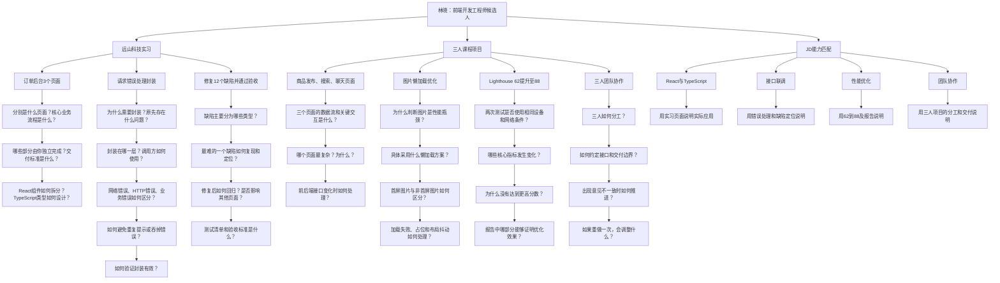

方括号内容需在投递前补齐；正文未加入未经核实的技术栈或成果。

# 定向中文简历

## 林晓

**求职意向：前端开发工程师｜2027届软件工程本科**

手机：[手机号]　邮箱：[邮箱]　所在地：[城市]  
GitHub / 作品集：[链接]

### 个人概述

具备 React、TypeScript 前端开发实践。曾在远山科技独立负责订单后台 3 个页面，完成请求错误处理封装，并依据测试清单修复 12 个缺陷、通过验收。三人课程项目中负责前端，实现商品发布、搜索及聊天页面，通过图片懒加载将同一移动端测试条件下的 Lighthouse 性能分从 62 提升至 88。具备页面交付、接口请求处理、性能优化及团队项目经验。

### 核心能力

- **前端开发：** React、TypeScript，具备后台页面和移动端页面开发经验
- **接口请求处理：** 有请求错误处理封装实践，能够处理页面请求异常
- **性能优化：** 使用图片懒加载优化移动端加载性能，能够通过 Lighthouse 对比验证效果
- **质量保障：** 能够依据测试清单复现、修复并验证缺陷
- **团队协作：** 参与三人课程项目，独立承担前端模块交付

### 实习经历

**远山科技｜前端开发实习生｜2025.06–2025.08**

- 使用 React、TypeScript 独立负责订单后台 3 个页面的开发与交付。
- 封装请求错误处理，对页面请求异常进行统一处理。
- 根据测试清单定位并修复 12 个缺陷，完成修复验证并通过项目验收。

### 项目经历

**商品发布、搜索与聊天课程项目｜前端开发｜三人团队**

- 在三人团队中负责前端开发，实现商品发布、商品搜索和聊天页面。
- 针对移动端图片加载性能进行优化，引入图片懒加载。
- 在相同移动端测试条件下，将 Lighthouse 性能分从 62 提升至 88，提升 26 分；测试报告可核验。

### 教育背景

**[学校名称]｜软件工程｜本科｜预计 2027 年毕业**

---

# ATS 纯文本版

```text
林晓
求职意向：前端开发工程师
2027届软件工程本科

手机：[手机号]
邮箱：[邮箱]
所在地：[城市]
GitHub或作品集：[链接]

个人概述
具备React、TypeScript前端开发实践。曾在远山科技独立负责订单后台3个页面，完成请求错误处理封装，并依据测试清单修复12个缺陷、通过验收。三人课程项目中负责前端，实现商品发布、搜索及聊天页面，通过图片懒加载将同一移动端测试条件下的Lighthouse性能分从62提升至88。具备页面交付、接口请求处理、性能优化及团队项目经验。

专业技能
前端开发：React、TypeScript
接口请求处理：请求错误处理封装、页面请求异常处理
性能优化：图片懒加载、Lighthouse性能测试
质量保障：缺陷定位、缺陷修复、测试清单、验收
团队协作：三人项目协作、前端模块交付

实习经历
远山科技
前端开发实习生
2025.06-2025.08

1. 使用React、TypeScript独立负责订单后台3个页面的开发与交付。
2. 封装请求错误处理，对页面请求异常进行统一处理。
3. 根据测试清单定位并修复12个缺陷，完成修复验证并通过项目验收。

项目经历
商品发布、搜索与聊天课程项目
角色：前端开发
团队规模：3人

1. 负责前端开发，实现商品发布、商品搜索和聊天页面。
2. 针对移动端图片加载性能进行优化，引入图片懒加载。
3. 在相同移动端测试条件下，将Lighthouse性能分从62提升至88，提升26分，测试报告可核验。

教育背景
[学校名称]
软件工程
本科
预计2027年毕业
```

# 六维审查

| 维度 | 评分 | 审查结论 |
|---|---:|---|
| JD 匹配度 | 9/10 | React、TypeScript、性能优化和团队项目均有直接证据；接口联调目前主要由请求错误处理侧面支撑。 |
| 成果量化 | 9.5/10 | 3 个页面、12 个缺陷、62→88，数字清晰且性能报告可核验。 |
| 经历可信度 | 9/10 | 使用“独立负责”“通过验收”“同一测试条件”等边界明确的表述，没有夸大业务结果。 |
| 技术深度 | 6.5/10 | 已说明做了什么，但缺少错误分类、封装层级、懒加载实现方式及性能指标变化等细节。 |
| 协作证据 | 6.5/10 | 已体现三人团队和个人分工，但尚无任务协商、接口约定或冲突处理案例。 |
| ATS 完整度 | 7.5/10 | 关键词和结构友好；学校、联系方式、项目时间等字段补齐后再投递。 |

**综合：8.0/10。** 当前最有竞争力的是“可量化、可验收、可核验”。面试前应重点补足技术决策和协作过程，而不是继续堆叠泛化形容词。

投递前优先处理：

1. 补齐手机号、邮箱、学校、城市及项目时间。
2. 准备解释请求错误处理的封装位置、错误类型和调用方式。
3. 熟悉 12 个缺陷中最典型的 1–2 个完整修复过程。
4. 携带或熟悉 Lighthouse 报告，确保能说明测试环境及优化前后差异。
5. 只有确实使用过时，才补充状态管理、路由、构建工具、接口工具或代码仓库链接。

# 面试追问图


